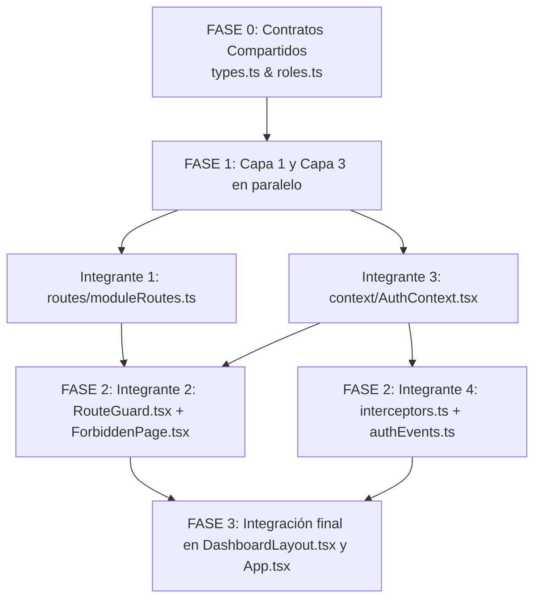

# Plan de Implementación: 4 Capas de Protección de Rutas en NexstayV2

Este plan adapta el modelo de protección de rutas frontend (originalmente concebido para Vue 3 + Pinia + Vue Router en JHipster) a la arquitectura real de **NexstayV2** (**Electron + React 19 + TypeScript + Tailwind CSS**).

El objetivo es organizar a los **4 integrantes del equipo** para que cada uno desarrolle su capa de forma independiente, desacoplada y sin colisiones de Git ni carpetas duplicadas.

---

## 1. Análisis del Proyecto Actual vs. Documento Base

| Concepto en Guía Base (Vue 3 / JHipster) | Equivalente Real en NexstayV2 | Ubicación en NexstayV2 |
|---|---|---|
| **Framework UI** | Vue 3 + Single File Components (`.vue`) | **React 19 + TypeScript (`.tsx`)** en Electron Renderer |
| **Enrutador** | `vue-router` (`createWebHistory`) | **Router de Módulos / React Router** (`src/renderer/src/routes/`) |
| **Gestión de Estado** | Pinia (`account-store.ts`) | **React Context / Auth Store** (`src/renderer/src/context/` o `stores/`) |
| **Cliente HTTP** | Axios con Interceptors | **Fetch API / `client.ts`** (`src/renderer/src/lib/api/`) |
| **Roles** | `ROLE_ADMIN`, `ROLE_FUNCTIONARY`, etc. | **`Role.ADMIN` y `Role.RECEPTION`** (coincidente con Prisma en `@sapay/database`) |
| **Almacenamiento Token** | `localStorage['jhi-authenticationToken']` | `localStorage.getItem('sapay-token')` |

---

## 2. Nueva Estructura de Carpetas Sugerida

Para evitar duplicidad y mantener concordancia con `apps/desktop/src/renderer/src/`, todos los archivos nuevos se ubicarán bajo esta convención:

```text
apps/desktop/src/renderer/src/
├── routes/                           <-- [INTEGRANTE 1 & 2] Sistema de rutas y navegación
│   ├── types.ts                      <-- Contratos: RouteConfig, Role, RouteMeta
│   ├── roles.ts                      <-- Enum de roles y jerarquías (ADMIN, RECEPTION)
│   ├── moduleRoutes.ts               <-- Definición de cada ruta con sus roles permitidos
│   ├── index.ts                      <-- Exportación unificada de rutas
│   └── RouteGuard.tsx                <-- [INTEGRANTE 2] Componente Guard que bloquea navegación
│
├── pages/                            <-- Vistas de la aplicación
│   ├── ... (páginas existentes)
│   ├── ForbiddenPage.tsx             <-- [INTEGRANTE 2] Vista de Acceso Denegado (403)
│   └── NotFoundPage.tsx              <-- [INTEGRANTE 2] Vista de Módulo no encontrado (404)
│
├── context/                          <-- [INTEGRANTE 3] Estado global de sesión e identidad
│   └── AuthContext.tsx               <-- Proveedor y hook useAuthSession (hasRole, hasAnyRole)
│
├── services/                         <-- [INTEGRANTE 3] Servicios desacoplados de UI
│   └── account.service.ts            <-- Carga de perfil, validación de token y roles
│
└── lib/
    └── api/                          <-- [INTEGRANTE 4] Capa de red e interceptores
        ├── client.ts                 <-- Cliente base existente (adaptado)
        ├── interceptors.ts           <-- Pipeline interceptor de 401/403 y auth header
        └── authEvents.ts             <-- Bus de eventos desacoplado (auth:unauthorized, etc.)
```

> [!IMPORTANT]
> **Regla de Oro anti-conflictos:** Ningún integrante creará carpetas fuera de este esquema. Los nombres de carpetas se usarán en **minúsculas** (`routes`, `context`, `services`), y los componentes de React en **PascalCase** (`RouteGuard.tsx`, `ForbiddenPage.tsx`).

---

## 3. Asignación de Capas por Integrante y Contratos Técnicos

### Integrante 1: Capa 1 – Declaración de Roles y Catálogo de Rutas
* **Responsabilidad:** Crear las definiciones de roles, los metadatos de acceso y la lista centralizada de rutas/módulos.
* **Archivos a su cargo:**
  1. `routes/roles.ts`: Enum `Role` unificado.
  2. `routes/types.ts`: Interfaces `RouteConfig`, `RouteMeta`, `ModuleKey`.
  3. `routes/moduleRoutes.ts`: Declaración de módulos con roles permitidos.
  4. `routes/index.ts`: Barrel export.
* **Contrato a respetar (TypeScript):**
```ts
// routes/roles.ts
export enum Role {
  ADMIN = 'ADMIN',
  RECEPTION = 'RECEPTION'
}

// routes/types.ts
import type { ComponentType, ReactElement } from 'react';
import type { Role } from './roles';

export interface RouteMeta {
  title: string;
  roles?: Role[];          // Si está vacío o undefined, es pública / libre para cualquier autenticado
  isPublic?: boolean;      // Para vistas anónimas como Login o Primer Arranque
}

export interface AppRoute {
  key: string;             // ej: 'recepcion', 'auditoria', 'inventario'
  path: string;            // ej: '/recepcion', '/auditoria'
  meta: RouteMeta;
  component: ComponentType<any>;
}
```
* **Matriz de Permisos NexstayV2:**
  - `ADMIN` solamente: `auditoria`, `config`, `usuarios`, `reportes-avanzados`.
  - `ADMIN` + `RECEPTION`: `recepcion`, `habitaciones`, `huespedes`, `reservas`, `clientes`, `ventas`, `lavanderia`, `parqueadero`, `perfil`, `dashboard`.
  - Públicas: `login`, `register`, `forgot-password`, `reset-password`.

---

### Integrante 2: Capa 2 – Guard Global de Navegación y Vistas de Error
* **Responsabilidad:** Crear el componente o hook de protección que evalúa si el usuario activo tiene permiso para ver el módulo solicitado antes de renderizarlo. Si no tiene permiso, mostrar la vista 403 Forbidden.
* **Archivos a su cargo:**
  1. `routes/RouteGuard.tsx`: Componente contenedor que evalúa la ruta activa vs. los roles del usuario.
  2. `pages/ForbiddenPage.tsx`: Pantalla amigable de "Acceso Denegado (403)" con botón para volver al módulo inicial.
  3. `pages/NotFoundPage.tsx`: Pantalla amigable de "Módulo no encontrado (404)".
  4. Integración del Guard en `components/DashboardLayout.tsx`.
* **Lógica del Guard (Paso a Paso):**
```
Navegación hacia 'activeModule'
  1. ¿Ruta existe en el catálogo de Capa 1?
     NO -> Renderizar NotFoundPage (404)
  2. ¿Ruta requiere roles específicos (meta.roles && meta.roles.length > 0)?
     NO -> Acceso permitido (Renderizar Componente)
     SÍ -> Consultar Capa 3: ¿auth.hasAnyRole(route.meta.roles)?
           SÍ -> Acceso permitido (Renderizar Componente)
           NO -> Renderizar ForbiddenPage (403) con advertencia de permisos insuficientes
```

---

### Integrante 3: Capa 3 – Sesión, Identidad y Autorización
* **Responsabilidad:** Centralizar el estado de autenticación y exponer métodos helpers (`hasRole`, `hasAnyRole`) mediante un Context de React (`AuthContext`), desacoplando la lógica de sesión de los formularios de login.
* **Archivos a su cargo:**
  1. `services/account.service.ts`: Métodos para validar token, obtener perfil actual (`/auth/me`), y validar authorities.
  2. `context/AuthContext.tsx`: `AuthProvider` y hook `useAuthSession()`.
* **Contrato a respetar (TypeScript):**
```ts
// context/AuthContext.tsx
import type { PublicUser } from '../lib/api';
import type { Role } from '../routes/roles';

export interface AuthContextType {
  user: PublicUser | null;
  isAuthenticated: boolean;
  isRestoringSession: boolean;
  hasRole: (role: Role) => boolean;
  hasAnyRole: (roles: Role[]) => boolean;
  login: (token: string, user: PublicUser) => void;
  logout: (reason?: string) => void;
  refreshAccount: () => Promise<PublicUser | null>;
}
```
* **Puntos clave:**
  - El helper `hasAnyRole` es el que consumirá directamente el **Integrante 2** en el `RouteGuard`.
  - Manejo persistente del token `sapay-token` y soporte para auto-recuperación al iniciar Electron.

---

### Integrante 4: Capa 4 – Interceptor HTTP (Manejo de 401 / 403 y Auto-Logout)
* **Responsabilidad:** Garantizar que cualquier llamada a la API inyecte el token JWT en las cabeceras (`Bearer <token>`) y que las respuestas HTTP con código **401 Unauthorized** o **403 Forbidden** disparen un cierre de sesión inmediato con notificación al usuario, evitando estados corruptos.
* **Archivos a su cargo:**
  1. `lib/api/authEvents.ts`: Event target / bus de eventos liviano desacoplado.
  2. `lib/api/interceptors.ts`: Middleware / interceptor para peticiones y respuestas de `apiRequest`.
  3. Actualización de `lib/api/client.ts` para conectar el pipeline de intercepción.
  4. Modal/Toast de "Sesión expirada" o redirección limpia al login en el nivel raíz (`App.tsx`).
* **Mecanismo de Desacople:**
```ts
// lib/api/authEvents.ts
type AuthEventCallback = (detail?: { reason: string; status: number }) => void;

class AuthEventBus {
  private listeners: Record<string, AuthEventCallback[]> = {};
  
  on(event: 'unauthorized' | 'forbidden', callback: AuthEventCallback) {
    (this.listeners[event] ||= []).push(callback);
    return () => {
      this.listeners[event] = this.listeners[event].filter(cb => cb !== callback);
    };
  }
  
  emit(event: 'unauthorized' | 'forbidden', detail?: { reason: string; status: number }) {
    this.listeners[event]?.forEach(cb => cb(detail));
  }
}

export const authEvents = new AuthEventBus();
```
* **Flujo del Interceptor:**
```
Respuesta HTTP desde backend
  -> Status 200/201: Devuelve payload JSON normalmente.
  -> Status 401: Token inválido o expirado
     -> authEvents.emit('unauthorized', { reason: 'Sesión expirada', status: 401 })
     -> Capa 3 escucha el evento, limpia token y resetea estado de sesión a Login.
  -> Status 403: Acción prohibida en backend
     -> authEvents.emit('forbidden', { reason: 'Acceso denegado en el servidor', status: 403 })
```

---

## 4. Orden de Implementación y Estrategia Git

Para evitar bloqueos mutuos, el trabajo debe seguir este orden cronológico en ramas independientes:



### Ramas de Git recomendadas:
- `feature/capa-1-rutas-roles` (Integrante 1)
- `feature/capa-2-guard-navegacion` (Integrante 2)
- `feature/capa-3-sesion-identidad` (Integrante 3)
- `feature/capa-4-interceptor-http` (Integrante 4)

---

## 5. Plan de Verificación

### Pruebas Funcionales por Capa:
1. **Capa 1 & 2 (Guard y Forbidden):**
   - Iniciar sesión como recepcionista (`Role.RECEPTION`).
   - Intentar acceder al módulo de "Auditoría" o "Configuración".
   - *Resultado esperado:* El Guard bloquea la visualización del módulo y muestra `ForbiddenPage` con mensaje de permisos insuficientes.
2. **Capa 3 (Sesión y Roles):**
   - Comprobar que `hasAnyRole([Role.ADMIN])` devuelva `false` para recepcionista y `true` para administrador.
   - Refrescar la aplicación (o reiniciar Electron) y confirmar que la sesión persiste mediante el token guardado.
3. **Capa 4 (Interceptor 401/403):**
   - Forzar una llamada con token expirado o inválido.
   - *Resultado esperado:* El interceptor captura el 401, emite el evento, borra `sapay-token` de localStorage y redirige a la pantalla de Login con el mensaje "Tu sesión expiró. Inicia sesión nuevamente."
